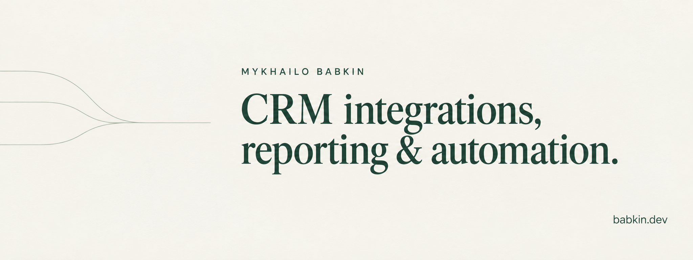

I'm a software engineer. I build CRM integrations, reporting systems and workflow automation around the tools a business already uses.

I work directly with businesses and with agencies that need an engineer for client projects. I handle implementation, testing and handover.

[Website](https://babkin.dev) · [LinkedIn](https://www.linkedin.com/in/mykhailobabkin/) · [X](https://x.com/babkin_ai)

## Selected work

### CRM reporting and call coaching

For a B2B sales team, I built a nightly process that pulls data from VanillaSoft into reports and a dashboard. The system also scores eligible call recordings against the team's own scorecard and uses those results to shape practice calls through the existing CRM.

[Read the case study](https://babkin.dev/blog/call-coaching-without-listening-to-calls)

### Less Annoying CRM to Attio

For an investment firm, I restructured relationship tags into fields, rebuilt linked investment records and checked imported values against source data. The Attio workspace includes views for follow-ups and pipeline review. The build is complete; the team's final changeover and reconciliation are still ahead.

[Read the case study](https://babkin.dev/blog/less-annoying-crm-to-attio-migration)

## Tools I work with

Python, TypeScript, React, Next.js, Supabase, n8n and CRM APIs. The choice depends on the existing system and the work it needs to do.

## Open source

[Claude Power-Ups](https://github.com/Mykhailobabkin/claude-powerups): skills and plugins for Claude Code, including YouTube transcript analysis and Obsidian workflows.

Most client code is private. The case studies explain what I built, the decisions behind it and the remaining limitations.

## Working together

Have a CRM, reporting or integration project that needs an engineer? [See how I work and get in touch](https://babkin.dev/about).

Profile repository documentation

[Documentation](docs/README.md) · [Project context](docs/project.md) · [Agent guide](AGENTS.md) · [Changelog](CHANGELOG.md)

